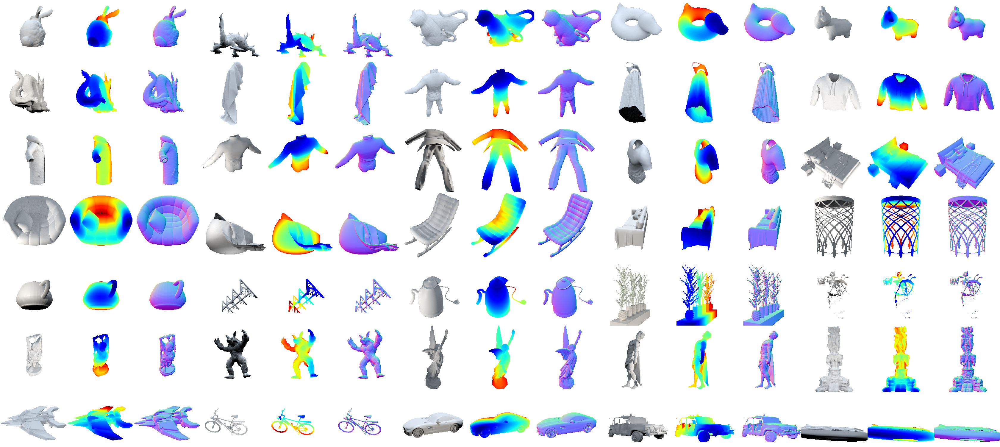

# Shape2.5D: A Dataset of Texture-less Surfaces for Depth and Normals Estimation

[](#)
[](#)
[](https://projects.dfki.uni-kl.de/textureless_object_data/)
[](#)
[](https://creativecommons.org/licenses/by/4.0/)



Official repository of the paper titled "[Shape2.5D: A Dataset of Texture-less Surfaces for Depth and Normals Estimation](#)" by Muhammad Saif Ullah Khan, Muhammad Zeshan Afzal, and Didier Stricker.

> [!TIP]  
> **TL;DR**
> - We introduce a novel dataset, **Shape2.5D**:
>   - For depth and normals estimation on texture-less surfaces
>   - 302k synthetic frames for 48 3D models.
>   - 62k more synthetic frames for 2600 ShapeNet objects.
>   - 4672 real-world frames for 6 clothing and household items.
>   - Available for download [here](https://projects.dfki.uni-kl.de/textureless_object_data/).
> - Benchmarks using an encoder-decoder network for depth and normals estimation.
> - Our repository also contains:
>   - The [generation pipeline](#generation-pipeline) using Blender and Python.
>   - A [PyTorch dataloader](./src/dataloader.py) for the dataset.
>   - A [visualization script](./src/visualize.py) for the dataset.

## Abstract

Reconstructing texture-less surfaces poses unique challenges in computer vision, primarily due to the lack of specialized datasets that cater to the nuanced needs of depth and normals estimation in the absence of textural information. We introduce ”Shape2.5D,” a novel, large-scale dataset designed to address this gap. Comprising 364k images spanning 2648 3D models, our dataset provides depth and surface normal maps for texture-less object reconstruction. The proposed dataset includes synthetic images rendered with 3D modeling software to simulate various lighting conditions and viewing angles. It also incldues a real-world subset comprising 4672 frames captured with a depth camera. Our comprehensive benchmarks, performed using a modified encoder-decoder network, showcase the dataset’s capability to support the development of algorithms that robustly estimate depth and normals from RGB images. Our open-source data generation pipeline allows the dataset to be extended and adapted for future research.

## Installation

Our source code was tested with [Blender 2.93.6](https://git.blender.org/gitweb/gitweb.cgi/blender.git/commit/c842a90e2fa1a39da8f28004f17f2931f4dde506) and Python 3.10 on Ubuntu 20.04.4 LTS.

We [built Blender from source](https://wiki.blender.org/wiki/Building_Blender/Linux/Ubuntu) and then used the following command to install the required packages:

```bash
$BLENDER_BUILD_LOCATION/bin/2.93.6/python/bin/python3.10 -m pip install 'opencv-python==4.5.5.64' 'numpy==1.22.4'
```

Make sure to replace `$BLENDER_BUILD_LOCATION` with the path to your Blender build. Please also add this to your system's PATH and make sure that you can run `blender` from the command line.

## Generation Pipeline

We provide scripts to render 3D models available as Wavefront OBJ files to generate more synthetic data. The pipeline uses Blender to render the models from different viewpoints and lighting conditions. The pipeline also generates ground truth depth and normal maps for each rendered image.

Make sure you have completed the installation steps above. Then, clone this repository and execute the following steps from the root directory of the repository.

### Preparing the Models

Create a directory named `models` in the root directory of the repository.

```bash
cd Shape25D
mkdir models
```

Copy the Wavefront OBJ files of the 3D models you want to generate data for into this directory. The pipeline will render images for each of these models.

### Generating the Data

We provide a script called [`generate_notex.py`](./src/generate_notex.py) to generate the data. It can be used as follows:

```bash
blender -b -P src/generate_notex.py --python-use-system-env -- \ 
    ./models/ \  # Path to the directory containing the 3D models
    --save_path ./out/  # Path to save the generated data
    --engine CYCLES \  # Use the Cycles renderer
    --use_gpu \  # Use the GPU for rendering
```

This script generates synthetic data for the models in the `models` directory and saves it in the `out` directory. The script also generates ground truth depth and normal maps for each rendered image.

### Visualizing the Data

We provide a script called [`visualize.py`](./src/visualize.py) to show samples of the generated data. Before visualizing data, you need to install PyTorch. You can install it using the following command:
```bash
pip install torch torchvision
```

PyTorch is required to load the data using the [provided dataloader](./src/dataloader.py). You can then visualize the data using the following command:
```bash
python src/visualize.py -d ./out/ -b 4
```
where `-d` specifies the path to the directory containing the generated data and `-b` specifies the number of samples to visualize.

## Citation

If you use the dataset or code in this repository, please cite the following arXiv paper:

```bibtex
@article{khan2024shape25d,
  title={Shape2.5D: A Dataset of Texture-less Surfaces for Depth and Normals Estimation},
  author={Khan, Muhammad Saif Ullah and Afzal, Muhammad Zeshan and Stricker, Didier},
  journal={arXiv preprint arXiv:2406.14370},
  year={2024}
}
```

## Acknowledgements

This dataset was created by the first author as a part of his Master's thesis at the German Research Center for Artificial Intelligence (DFKI). We would like to thank the DFKI for providing the necessary resources and support for this work.
